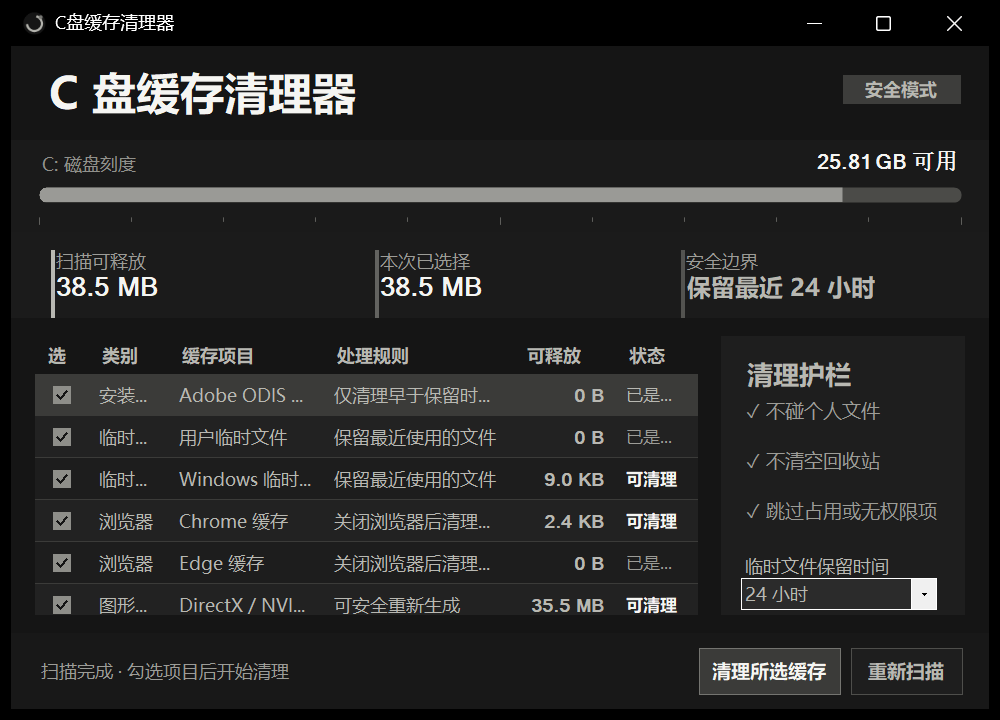

# C 盘缓存清理器

> 一款面向 Windows 的轻量级本地缓存清理工具：先扫描、再确认，只处理可重新生成的缓存。



## 项目简介

C 盘缓存清理器是一款无需安装的 WinForms 桌面工具，用来定位并清理常见的 Windows 缓存。程序把允许处理的目录写入安全白名单，不接受任意路径输入，也不会自动清理个人文件。

界面采用柔和炭黑主题，关键容量、可执行状态和主操作使用正白提亮，兼顾信息层级与长时间查看的舒适度。

## 主要功能

- 扫描 Adobe ODIS 旧下载包、用户临时文件和 Windows 临时文件。
- 扫描 Chrome、Edge 的网页资源、代码及 GPU 缓存。
- 清理 DirectX、NVIDIA 着色器缓存。
- 清理崩溃转储、Windows 错误报告和资源管理器缩略图。
- 临时文件可选择保留最近 24 小时、72 小时或 7 天。
- 清理前显示分类、规则和预计可释放空间，并要求再次确认。
- 清理后重新扫描，显示实际释放空间、删除数量和跳过数量。
- 自动跳过正在占用、没有权限、符号链接和目录联接的项目。

## 安全边界

程序不会处理：

- 桌面、下载、文档及其他个人文件。
- 回收站。
- 浏览器书签、密码、历史记录和 Cookie。
- 未列入程序白名单的目录。
- 符号链接、目录联接及其他重解析点。

清理内容不会进入回收站，但均属于应用或系统能够按需重新生成的缓存。建议清理前关闭浏览器、Adobe 安装器、游戏和大型设计软件，以减少被占用文件。

## 快速开始

1. 下载或复制 [`dist/CDriveCacheCleaner.exe`](dist/CDriveCacheCleaner.exe)。
2. 双击运行，等待扫描完成。
3. 检查并勾选需要处理的缓存项目。
4. 点击“清理所选缓存”，确认后执行。

程序无需管理员权限。Windows 系统目录中没有权限处理的文件会自动跳过。

## 系统要求

- Windows 10 或 Windows 11。
- .NET Framework 4.x；常规 Windows 10/11 通常已内置。
- 支持 32 位和 64 位 Windows 环境。

当前 EXE 未进行商业代码签名。首次运行时如果 Windows 显示“未知发布者”，请核对文件来源后选择“更多信息 → 仍要运行”。

## 从源码构建

项目不依赖 Visual Studio 或额外 NuGet 包，使用 Windows PowerShell 5.1 自带的 .NET Framework 编译器即可构建：

```powershell
powershell.exe -NoProfile -ExecutionPolicy Bypass -File .\build.ps1
```

构建结果位于：

```text
dist\CDriveCacheCleaner.exe
```

## 验证模式

安全自检仅在随机临时沙盒中创建和删除测试文件，用于验证“旧文件删除、近期文件保留、排除目录保留、磁盘根目录拒绝”等保护规则：

```powershell
.\dist\CDriveCacheCleaner.exe --self-test .\self-test.json
```

只扫描真实缓存并生成 JSON 报告，不执行清理：

```powershell
.\dist\CDriveCacheCleaner.exe --scan-report .\scan-report.json
```

## 项目结构

```text
.
├─ Program.cs                 # 应用界面、扫描、清理及安全策略
├─ build.ps1                  # Windows PowerShell 构建脚本
├─ dist/
│  └─ CDriveCacheCleaner.exe  # 可直接运行的程序
├─ ui-preview.png             # 界面预览
└─ CHANGELOG.md               # 版本记录
```

## 隐私说明

- 不上传文件列表、磁盘信息或清理记录。
- 不包含遥测、广告、账户系统或联网请求。
- 日志只保存在本机 `%LocalAppData%\CDriveCacheCleaner\Logs`。

## 开源许可

目前未附加开源许可证。未经项目所有者许可，不授予复制、修改或再发行本项目源码的权利。
